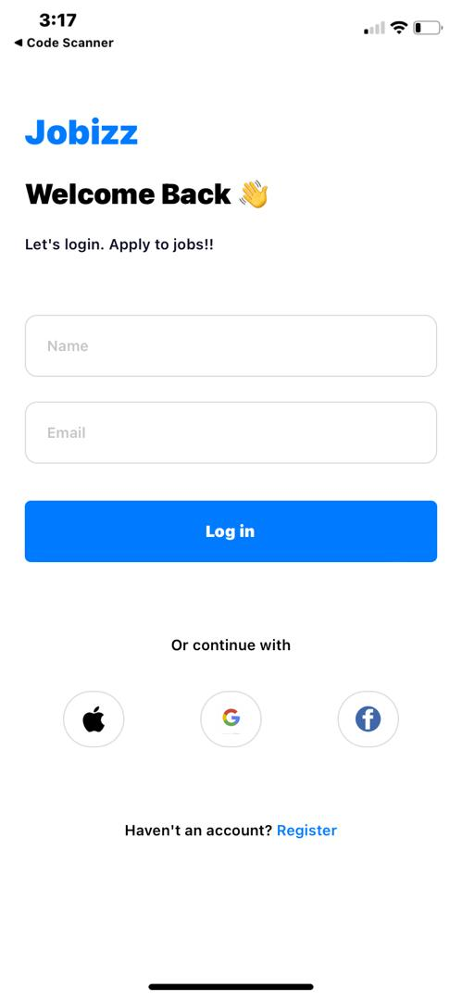
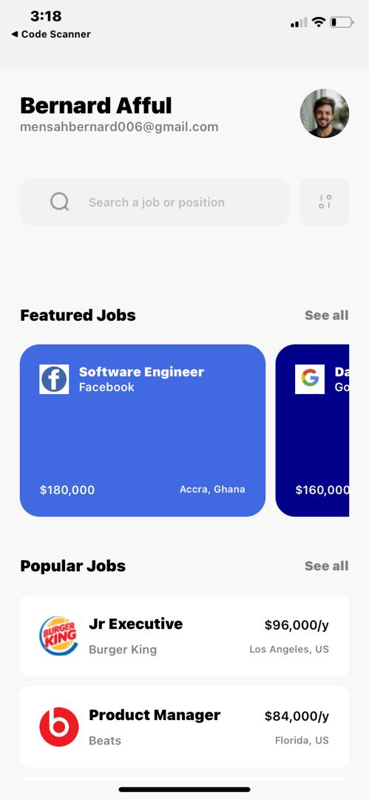
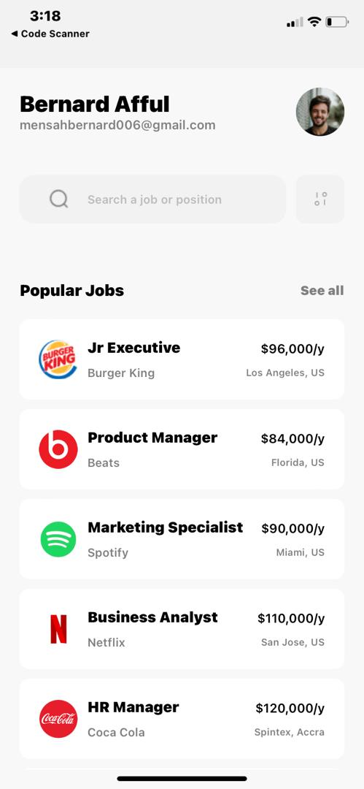
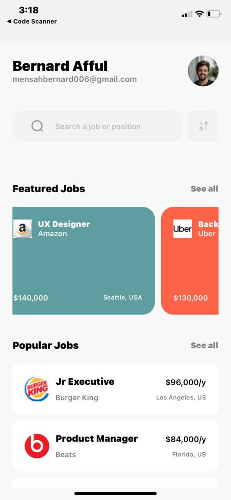

# rn-assignment4-11253585

# Jobizz

Jobizz is a job application mobile app built with React Native. The app allows users to log in and view a list of featured and popular job postings.

## Components

### `LoginScreen`

The `LoginScreen` component allows users to log in with their name and email. The user can also log in via social media platforms like Apple, Google, and Facebook.

**Props:** None

**State:**
- `name`: The user's name.
- `email`: The user's email.

**Functions:**
- `handleLogin`: Navigates to the HomeScreen with the provided name and email.

### `HomeScreen`

The `HomeScreen` component displays the user's name and email, a search bar, and lists of featured and popular job postings.

**Props:**
- `route`: Contains parameters `name` and `email` from the `LoginScreen`.

### `FeaturedJobCard`

The `FeaturedJobCard` component displays information about a featured job, including the title, company, salary, location, and an icon.

**Props:**
- `title`: The job title.
- `company`: The company name.
- `salary`: The job salary.
- `location`: The job location.
- `backgroundColor`: The background color of the card.
- `icon`: The icon for the job.

### `PopularJobCard`

The `PopularJobCard` component displays information about a popular job, including the title, company, salary, location, and an icon.

**Props:**
- `title`: The job title.
- `company`: The company name.
- `salary`: The job salary.
- `location`: The job location.
- `icon`: The icon for the job.

## Navigation

The navigation between screens is handled by React Navigation. The `AppNavigator` component sets up the navigation stack.

## Screenshots
Screenshots of the app can be found in the `screenshots` directory. Here are the paths for each screenshot:

